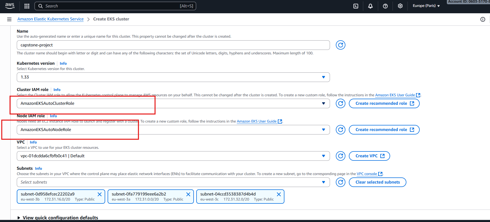
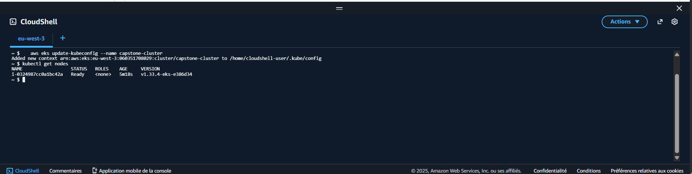
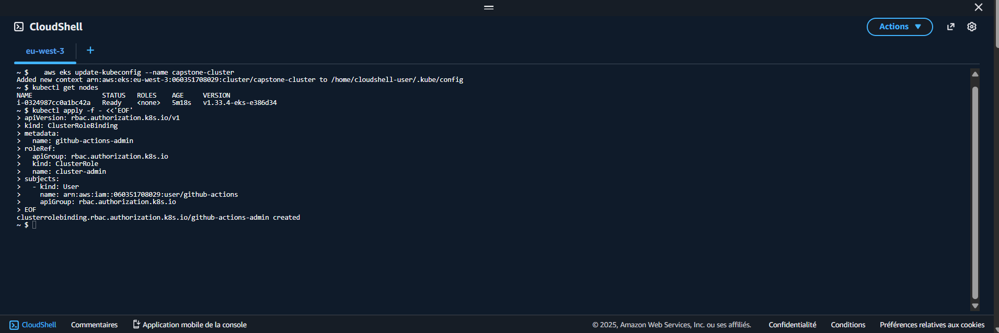
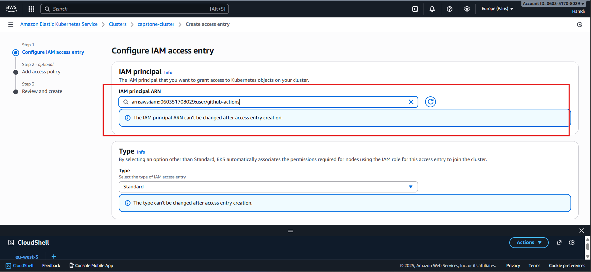
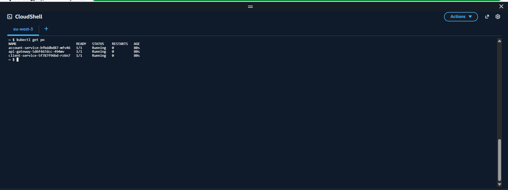
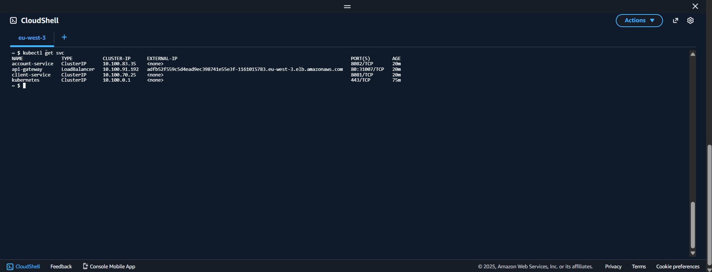
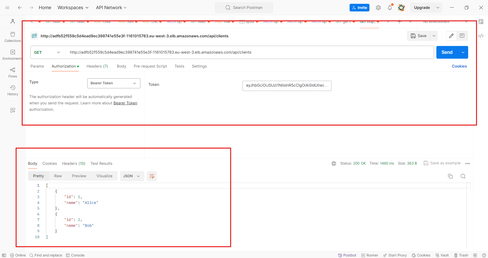

# **Capstone Lab – CI/CD with GitHub Actions and AWS EKS**

---

## **Objective**

The goal of this lab is to move from local development to a fully automated CI/CD pipeline for your Capstone application, composed of:

* `api-gateway`
* `client-service`
* `account-service`

Each service is a Spring Boot microservice built as a Docker image and deployed to **Amazon EKS**.
The CI/CD pipeline is handled by **GitHub Actions**, which builds, containers, and pushes the images to **Amazon Elastic Container Registry (ECR)**.

## **Architecture Overview**

Authentication is centralized with a shared Keycloak instance.

>💡 Keycloak is a **centralized Identity and Access Management (IAM)** solution.
>It manages:
>
>* Authentication (who you are),
>* Authorization (what you can access),
>* Token issuance for secure API communication.

In this architecture, **all microservices trust the same Keycloak realm** to validate JWT tokens.

Because authentication is a cross-cutting concern, it was necessary to deploy **Keycloak first**, outside of the EKS CI/CD flow.
This ensures:

* A **single, shared identity provider** for all participants in the lab,
* Stability of the login URLs and certificates (`https://capstone-keycloak.duckdns.org`),
* Simplified configuration for each microservice (same issuer and realm).

Keycloak was deployed on a dedicated **Amazon EC2 instance**, configured with:

* A **medium instance type** (`t3.medium`),
* A **public DNS** managed through **DuckDNS**,
* HTTPS certificates issued via **Let’s Encrypt**,
* Network rules allowing access on ports `8080` (HTTP) and `8443` (HTTPS).

💡 *Hint: This setup ensures that Keycloak remains available to all learner clusters or local deployments.*

---

## **1. Prerequisites**

Before starting:

* An **AWS account** with full access to:

   * EKS
   * ECR
   * IAM
   * EC2
* A **GitHub repository** containing your project with this structure:

  ```

  ├── capstone-api-gateway/
  │   ├── pom.xml
  │   ├── Dockerfile
  ├── capstone-client-service/
  │   ├── pom.xml
  │   ├── Dockerfile
  ├── capstone-account-service/
  │   ├── pom.xml
  │   ├── Dockerfile
  ```

Each service must have this **Dockerfile**:

```dockerfile
FROM eclipse-temurin:17-jdk-jammy
COPY target/*.jar app.jar
ENTRYPOINT ["java", "-jar", "/app.jar"]
```

💡 *Hint: this is the same Dockerfile used during the development session.*

---

## **2. Create the EKS Cluster**

1. Go to **Amazon EKS Console → Create cluster**.
2. Choose **Quick configuration (EKS Auto mode)**.
3. Fill the form:

   * **Name:** `capstone-cluster`
   * **Kubernetes version:** `1.33`
   * **Cluster IAM Role:** select *AmazonEKSAutoClusterRole*
   * **Node IAM Role:** select *AmazonEKSAutoNodeRole*   * **VPC:** choose *default VPC*
   * **Subnets:** select all public subnets (3a, 3b, 3c)
4. Click **Create**.

5. 

💡 *Hint: the cluster creation takes a few minutes.*

Once active, connect to it:

```bash
aws eks update-kubeconfig --region eu-west-3 --name capstone-cluster
kubectl get nodes
```


---

**3. Create Amazon ECR Repositories**

Create three repositories in **ECR** (one per service):

```bash
Repository Name : capstone/api-gateway
Repository Name : capstone/client-service
Repository Name : capstone/account-service
```

You will get URIs like:

```
123456789012.dkr.ecr.eu-west-3.amazonaws.com/capstone/api-gateway
```

💡 *Hint: keep these URIs, they will be used in your GitHub workflow.*

---

## **4. Configure GitHub Secrets in Your Application Code Repository**

In GitHub:

* Go to **Settings → Secrets and variables → Actions → New repository secret**
* Add:

| Name                     | Example                                        |
| ------------------------ | ---------------------------------------------- |
| `AWS_ACCESS_KEY_ID`      | `AKIA...`                                      |
| `AWS_SECRET_ACCESS_KEY`  | `wJalrXUtn...`                                 |
| `AWS_REGION`             | `eu-west-3`                                    |
| `ECR_REGISTRY`           | `123456789012.dkr.ecr.eu-west-3.amazonaws.com` |

💡 *Hint: never hardcode credentials inside workflows.*

---

## **5. Create the GitHub Actions Workflow**

Now that your EKS cluster and ECR repositories are ready, you will automate the **build** and **containerization** of your application using **GitHub Actions**.
This workflow ensures that each new code update results in a new, versioned Docker image pushed automatically to Amazon ECR.

---


### **Step 0  Create an IAM User for GitHub Actions**

GitHub Actions needs its own AWS credentials to push images and deploy updates.

1. Go to **AWS Console → IAM → Users → Add user**.

2. **User name:** `github-actions-<your-name>`.

3. Don't select **Provide user access to the AWS Management Console - optional** (no console access).

4. Click **Next: Permissions → Attach existing policies directly**.

5. Select these managed policies:

   ```
   AmazonEC2ContainerRegistryFullAccess
   AmazonEKSClusterPolicy
   AmazonEKSWorkerNodePolicy
   AmazonEKSServicePolicy
   ```

6. Finish → **Create user**.
7. **Download the credentials CSV file.**
8. Copy the **Access Key ID** and **Secret Access Key** — you will use them later as GitHub Actions secrets:
   * **Access Key ID →** `AWS_ACCESS_KEY_ID`
   * **Secret Access Key →** `AWS_SECRET_ACCESS_KEY`

---

💡 **Hint:** This user does **not** need console access, only API access.

## Granting GitHub Actions Access to EKS

1. Update your EKS cluster context by running:

   ```bash
   aws eks update-kubeconfig --name capstone-cluster
   ```
---

### Create a ClusterRoleBinding for the GitHub IAM user

Run the following command directly in CloudShell:

```bash
kubectl apply -f - <<'EOF'
apiVersion: rbac.authorization.k8s.io/v1
kind: ClusterRoleBinding
metadata:
  name: github-actions-admin
roleRef:
  apiGroup: rbac.authorization.k8s.io
  kind: ClusterRole
  name: cluster-admin
subjects:
  - kind: User
    name: <github-iam>
    apiGroup: rbac.authorization.k8s.io
EOF
```

This creates a **ClusterRoleBinding** named `github-actions-admin` that links the IAM user `github-actions` to the `cluster-admin` role.
It gives the GitHub Actions workflow full access to manage all Kubernetes resources in the cluster.



⚠️ Important:
Don’t forget to replace <github-iam> with the iam created in Step 0.

> Note: The cluster-admin role is a default Kubernetes role that provides the highest level of privileges across all namespaces in the cluster. It is typically used only for automation or administrative users.

---


### Register GitHub Actions IAM User in EKS (AWS Console)

This step lets your **GitHub Actions IAM user** authenticate with the EKS cluster API.

Without it, even if the user has EKS permissions in IAM, `kubectl` or `helm` commands in your workflow will fail later with *“You must be logged in to the server”*.

1. Open **AWS Console → EKS → Clusters → `<your-cluster>` → Access**.
2. Click **Add access entry**.
3. Set:

   * **Principal type:** `IAM user`
   * **Principal:** `arn:aws:iam::<account-id>:user/github-actions`
4. Leave **Access policies** empty.
5. Click **Create**.
6.


##
---

### **Step 1 – Create the workflow file**

Inside your GitHub repository, create the following structure:

```
.github/
 └── workflows/
      └── build.yml
```

---

### **Step 2 – Define when the workflow runs**

At the top of `build.yml`, define the triggers.

Your workflow should:

* Run **automatically** when you push code to the `main` branch (Continuous Integration).
* Be **manually triggered** when you want to test it from the Actions tab (`workflow_dispatch`).

💡 *Hint: Avoid triggering on every branch at first. Keeping it on `main` avoids unnecessary ECR uploads while testing locally.*

---

### **Step 3 – Define common environment variables**

Declare shared variables to avoid repetition in your steps:

* `AWS_REGION` → The AWS region (for example `eu-west-3`).
* `ECR_REGISTRY` → Your ECR endpoint (`<account-id>.dkr.ecr.eu-west-3.amazonaws.com`).

You can also define service repository names like:

* `ECR_REPOSITORY_API: capstone/api-gateway`
* `ECR_REPOSITORY_CLIENT: capstone/client-service`
* `ECR_REPOSITORY_ACCOUNT: capstone/account-service`

💡 *Hint: Store all sensitive values (access keys, registry URLs, repository names) as **secrets** in GitHub → Settings → Secrets and variables → Actions. Never hardcode them in YAML.*

---

### **Step 4 – Set up the build job**

Your job will use an Ubuntu runner.
Inside it, define the following actions in sequence:

1. **Checkout the repository**

    * Use `actions/checkout@v4` to clone the code.
    * Without this step, the runner has no access to your project files.

   💡 *Hint: Always keep this step first — every other step depends on the code being available locally.*

2. **Set up Java**

    * Use `actions/setup-java@v4` with:

        * `distribution: temurin`
        * `java-version: 17`
    * This ensures Maven builds use the same JDK version as your local environment.

   💡 *Hint: You can cache Maven dependencies later with `actions/cache` to speed up builds.*

3. **Configure AWS credentials**

    * Use `aws-actions/configure-aws-credentials@v4`
    * Provide your `AWS_ACCESS_KEY_ID`, `AWS_SECRET_ACCESS_KEY`, and region from GitHub secrets.

   💡 *Hint: If this step fails, verify your IAM user/role has the `AmazonEC2ContainerRegistryFullAccess` and `AmazonEKSClusterPolicy` permissions.*

4. **Log in to Amazon ECR**

    * Use `aws-actions/amazon-ecr-login@v2`
    * This stores a temporary Docker login token to your ECR.

   💡 *Hint: You can test this manually by running `aws ecr get-login-password` on your machine — the action automates that.*

---

### **Step 5 – Build and push each service**

Now you will define build steps for your three microservices.
Each step follows the same pattern, differing only by the working directory and ECR target.

#### Example flow per service:

1. Move to the service folder (`working-directory: ./api-gateway`).
2. Run Maven to compile and package the JAR:

   ```bash
   mvn clean package -DskipTests
   ```
3. Build the Docker image:

   ```bash
   docker build -t $ECR_REGISTRY/<repository-name>:latest .
   ```
4. Push the image:

   ```bash
   docker push $ECR_REGISTRY/<repository-name>:latest
   ```

💡 *Hint 1: Use the same tag (`latest`) for now. Later, you can use `${{ github.sha }}` to tag images with the commit ID for traceability.*
💡 *Hint 2: You can combine the build and push in one script block per service to keep the workflow clean.*

Repeat this process for:

* `api-gateway`
* `client-service`
* `account-service`

💡 *Hint: If one image fails to push, check that its corresponding ECR repository name matches exactly what you created in AWS.*

---

### **Step 6 – Validate your workflow**

Once you finish editing, commit and push:

```bash
git add .github/workflows/build.yml
git commit -m "Add CI workflow for building and pushing images to ECR"
git push origin main
```

Then, open **GitHub → Actions**:

* Select your workflow,
* Click **Run workflow** or wait for the automatic trigger.

You should see a real-time execution log with each step (checkout, Java setup, AWS login, Docker build, push).

💡 *Hint: Green checkmark = success. Red X = failed step. You can expand any step to see its console output.*

---

### **Step 7 – Verify images in Amazon ECR**

Log in to your AWS console → **ECR service** → open your repositories.
You should see the `latest` image tag for:

* `capstone/api-gateway`
* `capstone/client-service`
* `capstone/account-service`


💡 *Hint: If you don’t see the images, confirm that your GitHub workflow used the right AWS region and your ECR repository names are correct.*

---

### **Result**

You now have a fully automated **Continuous Integration** pipeline.
Each time code is pushed or merged into `main`:

* The project is built,
* Docker images are generated,
* Images are published to ECR.

This process ensures every microservice version is ready to be deployed to your **EKS cluster** in the next stage of the lab.

---

# **6. Kubernetes Deployment – From Compose to Manifests**

Now that the CI pipeline pushes images to Amazon ECR, it’s time to **deploy the application on EKS** using Kubernetes manifests.
You will gradually migrate from the Docker Compose configuration to a set of declarative YAML manifests — one per service.

In this phase, you will define:

* **Deployments** to manage Pods,
* **Services** for internal communication,
* **LoadBalancer** or **NodePort** to expose the API Gateway externally.

---

## **Step 1 – Keycloak context**

In Docker Compose, Keycloak was running locally with:

```yaml
ports:
  - "8080:8080"
```

In Kubernetes, you don’t need to redeploy it.
Keycloak is already deployed on an **EC2 instance**, accessible at:

```
https://capstone-keycloak.duckdns.org
```

This instance will act as your **central IAM provider** for all services inside the cluster.
Your microservices only need to reference its issuer URL:

```
https://capstone-keycloak.duckdns.org/realms/training-realm
```

---

## **Step 2 – Client Service Manifests**

You’ll start by converting the `client-service` section of your Docker Compose into Kubernetes manifests.

### **2.1 Deployment**

Create a file named `client-service-deployment.yaml`:

Define a Deployment with:

* 1 replica (for now),
* Image from your ECR (`<your-account>.dkr.ecr.eu-west-3.amazonaws.com/capstone/client-service:latest`),
* Container port `8081`.

💡 *Hint: The Deployment ensures your service restarts automatically if the container fails.*

### **2.2 Service**

Create a Service in the same file or separately:

Expose the deployment internally via a ClusterIP:

```yaml
apiVersion: v1
kind: Service
metadata:
  name: client-service
spec:
  selector:
    app: client-service
  ports:
    - port: 8081
      targetPort: 8081
  type: ClusterIP
```

💡 *Hint: ClusterIP is the default and is used for internal communication between Pods.*

---

## **Step 3 – Account Service Manifests**

Repeat the same process for the account service.

Create a file `account-service-deployment.yaml`:

* Use the image from ECR for the account service.
* Expose container port `8082`.
* Create a ClusterIP service named `account-service`.

💡 *Hint: In Compose, `account-service` communicated with `client-service` via the network `api-net`. In Kubernetes, the Service name automatically acts as the hostname.*

## **Step 4 – API Gateway Manifests**

Now you’ll prepare the entry point manifests — the **Spring Cloud Gateway** — which routes traffic to the two microservices.

---

### **4.1 ConfigMap**

To avoid hard-coding environment variables directly in the Deployment, create a ConfigMap named `api-gateway-configmap.yaml`.
It will hold all routing and Keycloak configuration values.

```yaml
apiVersion: v1
kind: ConfigMap
metadata:
  name: api-gateway-config
data:
  SERVER_PORT: "8083"

  SPRING_CLOUD_GATEWAY_ROUTES_0_ID: "client-service"
  SPRING_CLOUD_GATEWAY_ROUTES_0_URI: "http://client-service:8081"
  SPRING_CLOUD_GATEWAY_ROUTES_0_PREDICATES_0: "Path=/api/clients/**"
  SPRING_CLOUD_GATEWAY_ROUTES_0_FILTERS_0: "StripPrefix=1"

  SPRING_CLOUD_GATEWAY_ROUTES_1_ID: "account-service"
  SPRING_CLOUD_GATEWAY_ROUTES_1_URI: "http://account-service:8082"
  SPRING_CLOUD_GATEWAY_ROUTES_1_PREDICATES_0: "Path=/api/accounts/**"
  SPRING_CLOUD_GATEWAY_ROUTES_1_FILTERS_0: "StripPrefix=1"

  SPRING_SECURITY_OAUTH2_RESOURCESERVER_JWT_ISSUER_URI: "https://capstone-keycloak.duckdns.org/realms/training-realm"
```

💡 *Hint: ConfigMaps make your manifests cleaner and allow reusing the same Deployment across environments (dev, qa, prod).*

---

### **4.2 Deployment**

Now create the Deployment `api-gateway-deployment.yaml` referencing this ConfigMap.

```yaml
apiVersion: apps/v1
kind: Deployment
metadata:
  name: api-gateway
spec:
  replicas: 1
  selector:
    matchLabels:
      app: api-gateway
  template:
    metadata:
      labels:
        app: api-gateway
    spec:
      containers:
        - name: api-gateway
          image: <your-account-id>.dkr.ecr.eu-west-3.amazonaws.com/capstone/api-gateway:latest
          ports:
            - containerPort: 8083
          envFrom:
            - configMapRef:
                name: api-gateway-config
```

💡 *Hint: The `envFrom` directive loads all keys from the ConfigMap as environment variables inside the container.*

---

### **4.3 Service**

Expose the API Gateway to external users.
Use a `LoadBalancer` Service by default — AWS EKS will automatically create an external ELB with a public DNS.

```yaml
apiVersion: v1
kind: Service
metadata:
  name: api-gateway
spec:
  selector:
    app: api-gateway
  ports:
    - port: 80
      targetPort: 8083
  type: LoadBalancer
```

💡 *Hint: On AWS, this can take a few minutes while the ELB is created.*

---

### **If the LoadBalancer fails**

If the external LoadBalancer remains **`<pending>`**, switch to a **NodePort** service instead.
This exposes the gateway on each node’s public IP.

```yaml
apiVersion: v1
kind: Service
metadata:
  name: api-gateway
spec:
  selector:
    app: api-gateway
  ports:
    - port: 8083
      targetPort: 8083
      nodePort: 30083
  type: NodePort
```

💡 *Hint 1:* NodePort values must be between 30000–32767.
💡 *Hint 2:* When deploying, retrieve your node’s public IP with:

```bash
kubectl get nodes -o wide
```

Then test:

```bash
curl http://<Node-Public-IP>:30083/api/clients
```
---

# **7. Helm Packaging and Deployment**

Now that you have developed your Kubernetes manifests manually, it’s time to **automate and standardize deployments** using **Helm**.

>💡 Helm allows you to package all manifests (Deployments, Services, ConfigMaps, etc.) into a **single reusable chart**, simplifying upgrades, rollbacks, and parameterization across environments (dev, qa, prod).

---

## **Step 1 – Why Helm**

Manifests are fine for local tests, but they become difficult to manage as configuration grows.

With Helm, you can:

* Version your deployments (`Chart.yaml`)
* Reuse templates across services
* Override configuration dynamically (`values.yaml`)
* Upgrade or rollback deployments safely

---

## **Step 2 – Initialize the Chart**

Create a new Helm chart called `capstone` at the root of your project:

```bash
helm create capstone
```

This generates:

```
capstone/
├── Chart.yaml
├── values.yaml
├── charts/
└── templates/
    ├── deployment.yaml
    ├── service.yaml
    ├── configmap.yaml
    └── _helpers.tpl
```

Delete the default placeholder YAMLs — you’ll replace them with your real ones.

---

## **Step 3 – Define Chart Metadata**

Edit `capstone/Chart.yaml`:

```yaml
apiVersion: v2
name: capstone
description: Helm chart for the Capstone microservices (API Gateway, Client, Account)
version: 1.0.0
appVersion: "1.0.0"
```

💡 *Hint: The `appVersion` field matches your application’s version, while `version` tracks the chart itself.*

---

## **Step 4 – Organize Templates**

Inside `capstone/templates/`, create one folder per component:

```
templates/
├── api-gateway/
│   ├── deployment.yaml
│   ├── service.yaml
│   ├── configmap.yaml
├── client-service/
│   ├── deployment.yaml
│   └── service.yaml
└── account-service/
    ├── deployment.yaml
    └── service.yaml
```

💡 *Hint: You can also split charts into sub-charts (`charts/`) for modular deployments.*

---

## **Step 5 – Parameterize the Values**

Edit `capstone/values.yaml` to define defaults for all services:

```yaml
image:
  registry: 123456789012.dkr.ecr.eu-west-3.amazonaws.com
  tag: latest

apiGateway:
  name: api-gateway
  port: 8083
  serviceType: LoadBalancer
  keycloakIssuer: "https://capstone-keycloak.duckdns.org/realms/training-realm"

clientService:
  name: client-service
  port: 8081

accountService:
  name: account-service
  port: 8082
```

💡 *Hint: Later, you can override any value at install time using `--set` or a custom `values-prod.yaml`.*

---

## **Step 6 – Template the API Gateway**

Example: `templates/api-gateway/deployment.yaml`

```yaml
apiVersion: apps/v1
kind: Deployment
metadata:
  name: {{ .Values.apiGateway.name }}
spec:
  replicas: 1
  selector:
    matchLabels:
      app: {{ .Values.apiGateway.name }}
  template:
    metadata:
      labels:
        app: {{ .Values.apiGateway.name }}
    spec:
      containers:
        - name: api-gateway
          image: "{{ .Values.image.registry }}/capstone/api-gateway:{{ .Values.image.tag }}"
          ports:
            - containerPort: {{ .Values.apiGateway.port }}
          env:
            - name: SPRING_SECURITY_OAUTH2_RESOURCESERVER_JWT_ISSUER_URI
              value: "{{ .Values.apiGateway.keycloakIssuer }}"
            - name: SPRING_CLOUD_GATEWAY_ROUTES_0_URI
              value: "http://client-service:{{ .Values.clientService.port }}"
            - name: SPRING_CLOUD_GATEWAY_ROUTES_1_URI
              value: "http://account-service:{{ .Values.accountService.port }}"
```

Then, `templates/api-gateway/service.yaml`:

```yaml
apiVersion: v1
kind: Service
metadata:
  name: {{ .Values.apiGateway.name }}
spec:
  selector:
    app: {{ .Values.apiGateway.name }}
  ports:
    - port: 80
      targetPort: {{ .Values.apiGateway.port }}
  type: {{ .Values.apiGateway.serviceType }}
```

💡 *Hint: All hardcoded values from your previous manifests are now dynamic and reusable.*

---

## **Step 7 – Template Client and Account Services**

Repeat similar templates for both microservices, adjusting the ports and image names:

---

## **Step 8 – Render the Chart**

Before installing, you can preview the full Kubernetes YAML that Helm will generate.
This helps verify that your templates, variable names, and image references are correct.

Render the chart:

```bash
helm template capstone ./capstone
```

💡 *Hint: `helm template` expands all templates locally without applying anything to the cluster.*

If you want to save the rendered output to a file for review or version control:

```bash
helm template capstone ./capstone > rendered-capstone.yaml
```

You can then inspect the file content:

```bash
rendered-capstone.yaml
```

Voici la version **développée et complète** de la section **Step 9 – Integrate Helm into CI/CD**, adaptée à ton pipeline `Build, Push and Deploy Capstone to EKS`.
Elle explique chaque étape du job `deploy` et comment cela transforme le pipeline en une vraie **chaîne CI/CD complète** :

---

## **Step 9 – Integrate Helm into CI/CD**

Now that your GitHub Actions workflow successfully builds and pushes Docker images to **Amazon ECR**,
the next step is to **automatically deploy them to your EKS cluster** using **Helm**.

This integration converts your workflow from a *Continuous Integration (CI)* process
into a full *Continuous Deployment (CD)* pipeline.

---

### **1. Add a new job after the build**

At the end of your workflow, define a second job named `deploy` that depends on `build`:

```yaml
  deploy:
    name: Deploy All Services to EKS
    runs-on: ubuntu-latest
    needs: build
    environment: production
```

This ensures the deployment only runs **after** all Docker images are built and pushed successfully.

---

### **2. Checkout the Helm Chart and Source Code**

The first step inside the job is to fetch your Helm chart and templates:

```yaml
      - name: Checkout repository
        uses: actions/checkout@v4
```

This provides the Helm chart (in your `capstone/` directory) needed for deployment.

---

### **3. Authenticate to AWS**

The pipeline must have AWS access to connect to EKS and pull from ECR:

```yaml
      - name: Configure AWS credentials
        uses: aws-actions/configure-aws-credentials@v4
        with:
          aws-access-key-id: ${{ secrets.AWS_ACCESS_KEY_ID }}
          aws-secret-access-key: ${{ secrets.AWS_SECRET_ACCESS_KEY }}
          aws-region: ${{ env.AWS_REGION }}
```

This uses your repository’s encrypted AWS secrets to authenticate the workflow runner.

---

### **4. Install Kubernetes and Helm Tools**

To deploy resources, the runner needs both `kubectl` and `helm`:

```yaml
      - name: Install kubectl
        uses: azure/setup-kubectl@v4
        with:
          version: 'latest'

      - name: Install Helm
        uses: azure/setup-helm@v4
        with:
          version: 'latest'
```

These steps ensure the runner has the tools necessary to interact with the cluster.

---

### **5. Configure Access to the EKS Cluster**

Next, configure `kubectl` to communicate with your EKS cluster:

```yaml
      - name: Configure access to EKS cluster
        run: |
          aws eks update-kubeconfig --region $AWS_REGION --name capstone-cluster
```

This pulls the cluster’s credentials and updates the local `kubeconfig` used by `kubectl` and `helm`.

---

### **6. Verify Cluster Connectivity**

A sanity check to confirm access to the cluster:

```yaml
      - name: Verify cluster connectivity
        run: |
          kubectl get nodes
          kubectl get ns
```

You should see your EKS nodes in **Ready** state.

---

### **7. Deploy the Helm Chart**

Finally, deploy all microservices with Helm:

```yaml
      - name: Deploy all Capstone services via Helm
        run: |
          helm upgrade --install capstone ./capstone \
            --namespace default \
            --set image.registry=$ECR_REGISTRY \
            --set image.tag=latest \
            --set apiGateway.serviceType=LoadBalancer \
            --set apiGateway.keycloakIssuer="https://capstone-keycloak.duckdns.org/realms/training-realm" \
            --set clientService.name=client-service \
            --set accountService.name=account-service
```

### Explanation:

* `helm upgrade --install` → installs if it doesn’t exist, upgrades if it does.
* `--set` flags dynamically inject runtime values (registry, tag, Keycloak URL, service type).
* `apiGateway.serviceType=LoadBalancer` → automatically provisions a **public AWS ELB**.
* `image.tag=latest` ensures you deploy the newest Docker images built in the `build` job.

---

### **8. Validate Deployment**

Once Helm applies the changes, verify that the services and pods are live:

```yaml
      - name: Verify Deployment
        run: |
          kubectl get pods -n default
          kubectl get svc -n default
```
You should see:

* Pods in **Running** status.
* The `api-gateway` service exposing an **EXTERNAL-IP** (AWS ELB).

---

### **Verification and Testing**

Now let’s make sure that our application is running properly on AWS EKS.

**Let’s verify our resources in AWS CloudShell:**



We now have our Load Balancer configured and reachable at:
**[http://adfb52f559c5d4ead9ec398741e55e3f-1161015783.eu-west-3.elb.amazonaws.com](http://adfb52f559c5d4ead9ec398741e55e3f-1161015783.eu-west-3.elb.amazonaws.com)**

We can easily test it using `POSTMAN` or any HTTP client to send requests and validate the application workflow.



The **401 Unauthorized** response is expected — it confirms that **Keycloak authentication** is correctly enforced.


To access the secured endpoints, we need to include a **Bearer token**.
First, ensure that a user (e.g., `ryma`) exists in your **Keycloak realm**, then request a token using:

```bash
curl -s -X POST "https://capstone-keycloak.duckdns.org/realms/training-realm/protocol/openid-connect/token" \
  -d "client_id=api-gateway-client" \
  -d "grant_type=password" \
  -d "username=ryma" \
  -d "password=ryma" | jq -r .access_token
```

Copy the returned token, and add it in **Postman** under the **Authorization** tab as a **Bearer Token**.

After that, send your request again — the API should now respond successfully.




